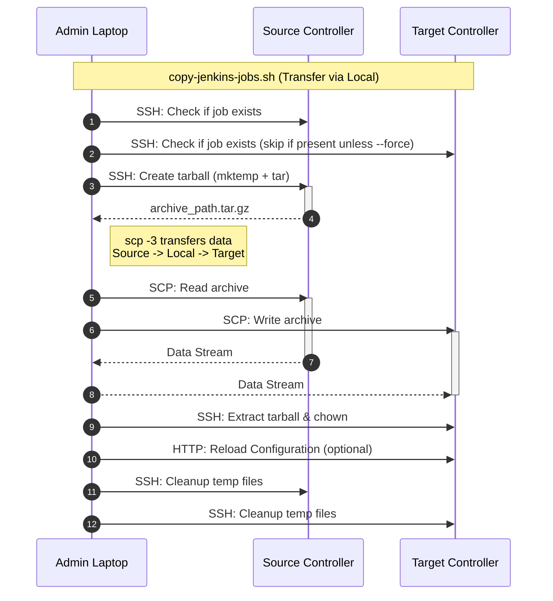
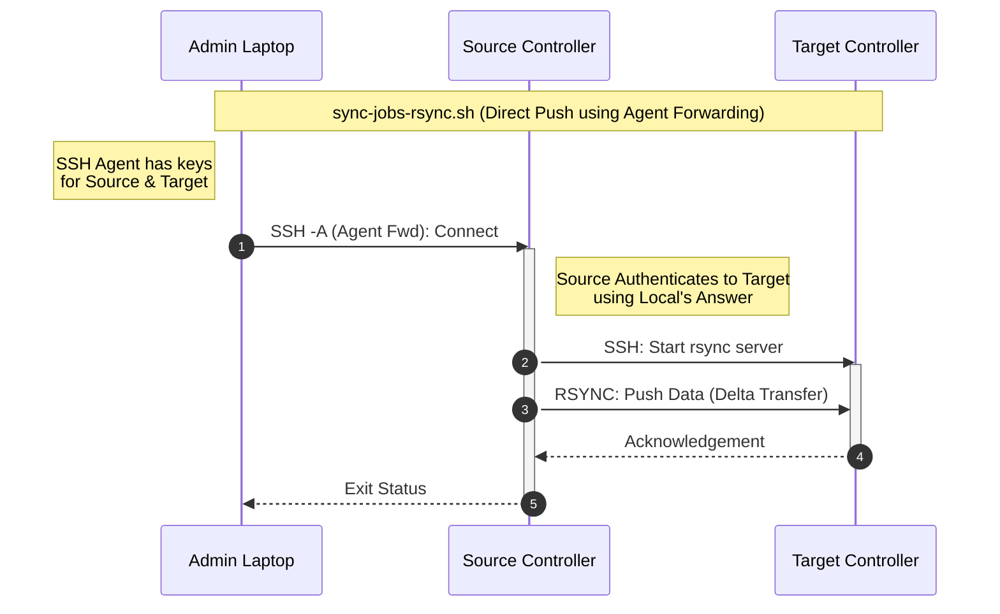

# Jenkins Job Copier

This repository contains scripts to copy Jenkins jobs from a source controller to a target controller.

## Scripts

1.  **`copy-jenkins-jobs.sh`**: Uses `scp` and `tar` to archive and transfer jobs. Good for simple transfers or when `rsync` is not available.
2.  **`sync-jobs-rsync.sh`**: Uses `rsync` over SSH. Efficient for syncing large jobs or incremental updates. Supports exclusions for build artifacts.

---

## Workflows

### `copy-jenkins-jobs.sh` (SCP Transfer)

Data flows through the admin's machine (`scp -3`).



### `sync-jobs-rsync.sh` (Rsync Push)

Data flows directly between controllers. Source authenticates to Target using the Admin's SSH Agent.



## `copy-jenkins-jobs.sh`

This is the main script for copying jobs using tarball archives.

### Requirements

- `bash`, `ssh`, `scp`, `tar`, `gzip`, `curl` must be installed on the machine running the script.
- The source and target controllers must be Linux-based.
- SSH access must be configured from the machine running the script to both Jenkins controllers. The SSH user must have `permissions` to read the Jenkins home directory and write to the target directory.

### Usage

```sh
./copy-jenkins-jobs.sh [OPTIONS]
```

**Required:**
```
  `--source-host <host>`          Source Jenkins controller hostname or IP.
  `--target-host <host>`          Target Jenkins controller hostname or IP.
  `--source-user <user>`          SSH user for the source host.
  `--target-user <user>`          SSH user for the target host.
  `--job-path <path>`             Subpath of the job to copy (e.g., "teamA/job1"). Can be specified multiple times.
  ```

**Optional:**
```
  `--source-jenkins-home <path>`  Path to Jenkins home on the source. (Default: /var/jenkins_home)
  `--target-jenkins-home <path>`  Path to Jenkins home on the target. (Default: /var/jenkins_home)
  `--ssh-port-source <port>`      SSH port for the source host (Default: 22).
  `--ssh-port-target <port>`      SSH port for the target host (Default: 22).
  `--ssh-key-source <path>`       Path to the SSH private key for the source.
  `--ssh-key-target <path>`       Path to the SSH private key for the target.
  `--jenkins-url-target <url>`    URL of the target Jenkins for config reload.
  `--jenkins-user <user>`         Jenkins user for reload authentication.
  `--jenkins-token <token>`       Jenkins API token for reload authentication.
  `--jenkins-owner <user>`        The user/group to own the job files on target. (Default: jenkins)
  `--force`                       Overwrite existing jobs on the target.
  `--dry-run`                     Show what would be done without making changes.
  `--verbose`                     Enable verbose logging.
  `--help`                        Display this help message.
```

### Examples

#### 1. Copy a Single Job

Copies the job located at `/var/jenkins_home/jobs/production-deployment`.

```sh
./copy-jenkins-jobs.sh \
  --source-host jenkins-prod.example.com \
  --target-host jenkins-staging.example.com \
  --source-user admin-user \
  --target-user admin-user \
  --ssh-key-source ~\.ssh/id_rsa_prod \
  --ssh-key-target ~\.ssh/id_rsa_staging \
  --job-path "production-deployment"
```

#### 2. Copy Multiple & Nested Jobs

Copies `nightly-builds` from the root of `jobs/` and `microservice-a` from a nested folder.

```sh
./copy-jenkins-jobs.sh \
  --source-host jenkins-prod.example.com \
  --target-host jenkins-staging.example.com \
  --source-user admin-user \
  --target-user admin-user \
  --job-path "nightly-builds" \
  --job-path "team-alpha/pipelines/microservice-a"
```

#### 3. Force Overwrite and Reload with Authentication

Overwrites the destination job and uses an API token to reload the target controller's configuration.

```sh
./copy-jenkins-jobs.sh \
  --source-host 10.0.1.10 \
  --target-host 10.0.2.20 \
  --source-user jenkins-svc \
  --target-user jenkins-svc \
  --job-path "important-job" \
  --force \
  --jenkins-url-target "https://jenkins.staging.example.com" \
  --jenkins-user "api-user" \
  --jenkins-token "11abcdef....."
```

#### 4. Dry Run

Preview the operations without making any changes.

```sh
./copy-jenkins-jobs.sh \
  --source-host jenkins-prod.example.com \
  --target-host jenkins-staging.example.com \
  --source-user admin-user \
  --target-user admin-user \
  --job-path "teamA/job1" \
  --job-path "folderX/job2" \
  --dry-run \
  --verbose
```

---

## `sync-jobs-rsync.sh`

This script uses `rsync` over SSH to synchronize jobs. It is more efficient for transfers (incremental) and allows powerful filtering.

### Requirements

- `rsync` must be installed on the **Source** and **Target** controllers.
- **SSH Agent Forwarding**: The script runs locally but executes `rsync` on the Source. You must have `ssh-agent` running locally with keys for both Source and Target loaded.
    - Run `ssh-add ~/.ssh/id_rsa_source` and `ssh-add ~/.ssh/id_rsa_target` before running the script.
- The Source host must be able to connect to the Target host on the SSH port.

### Usage

```sh
./sync-jobs-rsync.sh [OPTIONS]
```

**Required:**
```
  `--source-host <host>`          Source Jenkins controller hostname or IP.
  `--target-host <host>`          Target Jenkins controller hostname or IP.
  `--source-user <user>`          SSH user for the source host.
  `--target-user <user>`          SSH user for the target host.
  `--job-path <path>`             Subpath of the job to sync.
 ```

**Optional:**
```
  `--exclude <pattern>`           Rsync exclude pattern (e.g., 'builds/', 'workspace/').
  `--delete`                      Delete extraneous files on the target (`rsync --delete`).
  `--dry-run`                     Show what would be done.
  `--verbose`                     Enable verbose logging.
  `--ssh-port-source <port>`      (Default: 22)
  `--ssh-port-target <port>`      (Default: 22)
 ```

### Examples

#### 1. Basic Job Sync

Synchronize a job while excluding the workspace and build history (default behavior includes excluding `workspace/`, `lastStable`, etc., but you can add more).

```sh
./sync-jobs-rsync.sh \
  --source-host source.jenkins.example.com --source-user admin \
  --target-host target.jenkins.example.com --target-user admin \
  --job-path "MyFolder/MyJob" \
  --exclude "builds/" \
  --dry-run
```

#### 2. Sync with Delete

This will make the target directory an exact mirror of the source, DELETING any files on the target that are not present on the source (use with caution).

```sh
./sync-jobs-rsync.sh \
  --source-host source.jenkins.example.com --source-user admin \
  --target-host target.jenkins.example.com --target-user admin \
  --job-path "MyProject" \
  --delete
```

Sample output log:
```
➜  ci-copy-jobs git:(main) ✗ ./run_tests_sync-jobs-rsync.sh 

--- Cleaning up any previous Docker environment ---

--- Generating SSH keys for test ---
Generating public/private rsa key pair.
Your identification has been saved in ./jenkins_test_key_source
Your public key has been saved in ./jenkins_test_key_source.pub
The key fingerprint is:
SHA256:jCFPNJ2tGxAWdOJhf4w974HocyTW4zR+RIjFgIptYeM XXX@MAC-XXX-2.local
The key's randomart image is:
+---[RSA 4096]----+
|     .@=o=.      |
|    +=o*o*o.     |
|   =.++.+.* .    |
|  . E+ +o+ =     |
|   .  o SoB +    |
|       o.* = .   |
|        o + o    |
|         o .     |
|                 |
+----[SHA256]-----+
Generating public/private rsa key pair.
Your identification has been saved in ./jenkins_test_key_target
Your public key has been saved in ./jenkins_test_key_target.pub
The key fingerprint is:
SHA256:XXXXXXX/zo XXX@MAC-XXX-2.local
The key's randomart image is:
+---[RSA 4096]----+
|   o++o.       ..|
|  .+ *o o     . .|
|    * =..o . .  o|
|     . + o. o. o.|
|        S   o.o +|
|       . o = . o+|
|      E   o + .*o|
|       .o. o  +.=|
|        +B+. . o |
+----[SHA256]-----+
SSH keys generated.

--- Starting SSH Agent ---
Agent pid 80627
Identity added: ./jenkins_test_key_source (XXX@MAC-XXX-2.local)
Identity added: ./jenkins_test_key_target (XXX@MAC-XXX-2.local)

--- Building and starting Docker containers ---
[+] Building 11.3s (19/19) FINISHED                                                                                                                                                     
 => [internal] load local bake definitions                                                                                                                                         0.0s
 => => reading from stdin 1.14kB                                                                                                                                                   0.0s
 => [jenkins-source internal] load build definition from Dockerfile                                                                                                                0.0s
 => => transferring dockerfile: 1.21kB                                                                                                                                             0.0s
 => [jenkins-source internal] load metadata for docker.io/jenkins/jenkins:lts                                                                                                      1.4s
 => [auth] jenkins/jenkins:pull token for registry-1.docker.io                                                                                                                     0.0s
 => [jenkins-target internal] load .dockerignore                                                                                                                                   0.0s
 => => transferring context: 2B                                                                                                                                                    0.0s
 => [jenkins-source 1/8] FROM docker.io/jenkins/jenkins:lts@sha256:XXX                                                0.0s
 => => resolve docker.io/jenkins/jenkins:lts@sha256:XXX                                                               0.0s
 => CACHED [jenkins-target 2/8] RUN apt-get update && apt-get install -y openssh-server rsync                                                                                      0.0s
 => CACHED [jenkins-target 3/8] RUN echo 'root:root' | chpasswd                                                                                                                    0.0s
 => CACHED [jenkins-target 4/8] RUN mkdir -p /var/run/sshd                                                                                                                         0.0s
 => CACHED [jenkins-target 5/8] RUN sed -i 's/#PermitRootLogin prohibit-password/PermitRootLogin yes/' /etc/ssh/sshd_config                                                        0.0s
 => CACHED [jenkins-target 6/8] RUN sed -i 's/#PubkeyAuthentication yes/PubkeyAuthentication yes/' /etc/ssh/sshd_config                                                            0.0s
 => CACHED [jenkins-target 7/8] RUN sed -i 's/#StrictModes yes/StrictModes no/' /etc/ssh/sshd_config                                                                               0.0s
 => CACHED [jenkins-target 8/8] RUN echo "#!/bin/bash" > /usr/local/bin/start-jenkins-sshd.sh &&     echo "/usr/sbin/sshd -D &" >> /usr/local/bin/start-jenkins-sshd.sh &&     ec  0.0s
 => [jenkins-source] exporting to docker image format                                                                                                                              9.1s
 => => exporting layers                                                                                                                                                            0.0s
 => => exporting manifest sha256:XXX                                                                                  0.0s
 => => exporting config sha256:XXX                                                                                    0.1s
 => => sending tarball                                                                                                                                                             9.0s
 => [jenkins-target] exporting to docker image format                                                                                                                              9.1s
 => => exporting layers                                                                                                                                                            0.0s
 => => exporting manifest sha256:XXX                                                                                  0.1s
 => => exporting config sha256:XXX                                                                                    0.0s
 => => sending tarball                                                                                                                                                             9.0s
 => importing to docker                                                                                                                                                            0.0s
 => importing to docker                                                                                                                                                            0.0s
 => [jenkins-source] resolving provenance for metadata file                                                                                                                        0.0s
 => [jenkins-target] resolving provenance for metadata file                                                                                                                        0.0s
[+] Running 5/5
 ✔ ci-copy-jobs-jenkins-target   Built                                                                                                                                             0.0s 
 ✔ ci-copy-jobs-jenkins-source   Built                                                                                                                                             0.0s 
 ✔ Network ci-copy-jobs_default  Created                                                                                                                                           0.0s 
 ✔ Container jenkins-source      Started                                                                                                                                           0.6s 
 ✔ Container jenkins-target      Started                                                                                                                                           0.6s 
Containers are starting in the background...

--- Waiting for Jenkins controllers to be available... ---
Waiting for Jenkins on port 8081...
Jenkins on port 8081 is ready.
Waiting for Jenkins on port 8082...
Jenkins on port 8082 is ready.

--- Configuring SSH and creating test job on SOURCE ---
Successfully copied 2.56kB to jenkins-source:/root/.ssh/authorized_keys
Successfully copied 2.56kB to jenkins-target:/root/.ssh/authorized_keys

--- Creating job 'test-sync-job' on jenkins-source ---
Successfully copied 2.56kB to jenkins-source:/var/jenkins_home/jobs/test-sync-job/config.xml

--- Verifying job exists on SOURCE before copy ---
OK: Job 'test-sync-job' found on SOURCE.

--- Running the sync-jobs-rsync.sh script ---
=> Starting Jenkins job sync process...
   [VERBOSE] Source: root@localhost
   [VERBOSE] Target: root@jenkins-target
   [VERBOSE] Dry Run: true
=> Syncing job path: 'test-sync-job'
   [VERBOSE] Connecting to SOURCE to execute transfer...
Warning: Permanently added '[localhost]:2221' (ED25519) to the list of known hosts.
[REMOTE] Executing: rsync -avzR -e ssh -p 22 -o StrictHostKeyChecking=no --dry-run --exclude workspace/ --exclude lastStable --exclude lastSuccessful --exclude nextBuildNumber ./test-sync-job root@jenkins-target:/var/jenkins_home/jobs/
Warning: Permanently added 'jenkins-target' (ED25519) to the list of known hosts.
sending incremental file list
test-sync-job/

sent 139 bytes  received 16 bytes  310.00 bytes/sec
total size is 634  speedup is 4.09 (DRY RUN)
=> Successfully synced 'test-sync-job'.
=> Sync execution finished.
Dry run complete. Now running actual sync...
=> Starting Jenkins job sync process...
   [VERBOSE] Source: root@localhost
   [VERBOSE] Target: root@jenkins-target
   [VERBOSE] Dry Run: false
=> Syncing job path: 'test-sync-job'
   [VERBOSE] Connecting to SOURCE to execute transfer...
[REMOTE] Executing: rsync -avzR -e ssh -p 22 -o StrictHostKeyChecking=no --delete --exclude workspace/ --exclude lastStable --exclude lastSuccessful --exclude nextBuildNumber ./test-sync-job root@jenkins-target:/var/jenkins_home/jobs/
sending incremental file list
test-sync-job/

sent 216 bytes  received 16 bytes  464.00 bytes/sec
total size is 634  speedup is 4.09 (DRY RUN)
=> Successfully synced 'test-sync-job'.
=> Sync execution finished.
Dry run complete. Now running actual sync...
=> Starting Jenkins job sync process...
   [VERBOSE] Source: root@localhost
   [VERBOSE] Target: root@jenkins-target
   [VERBOSE] Dry Run: false
=> Syncing job path: 'test-sync-job'
   [VERBOSE] Connecting to SOURCE to execute transfer...
[REMOTE] Executing: rsync -avzR -e ssh -p 22 -o StrictHostKeyChecking=no --delete --exclude workspace/ --exclude lastStable --exclude lastSuccessful --exclude nextBuildNumber ./test-sync-job root@jenkins-target:/var/jenkins_home/jobs/
sending incremental file list
test-sync-job/

sent 216 bytes  received 16 bytes  464.00 bytes/sec
total size is 634  speedup is 2.73
=> Successfully synced 'test-sync-job'.
=> Sync execution finished.

--- Verifying job on TARGET after sync ---
SUCCESS: Job 'test-sync-job' directory found on TARGET.
SUCCESS: config.xml found in job directory on TARGET.

--- TEST SUCCEEDED! ---

--- Cleaning up ---
[+] Running 3/3
 ✔ Container jenkins-target      Removed                                                                                                                                           0.4s 
 ✔ Container jenkins-source      Removed                                                                                                                                           0.5s 
 ✔ Network ci-copy-jobs_default  Removed                                                                                                                                           0.3s 
Cleanup complete.


```