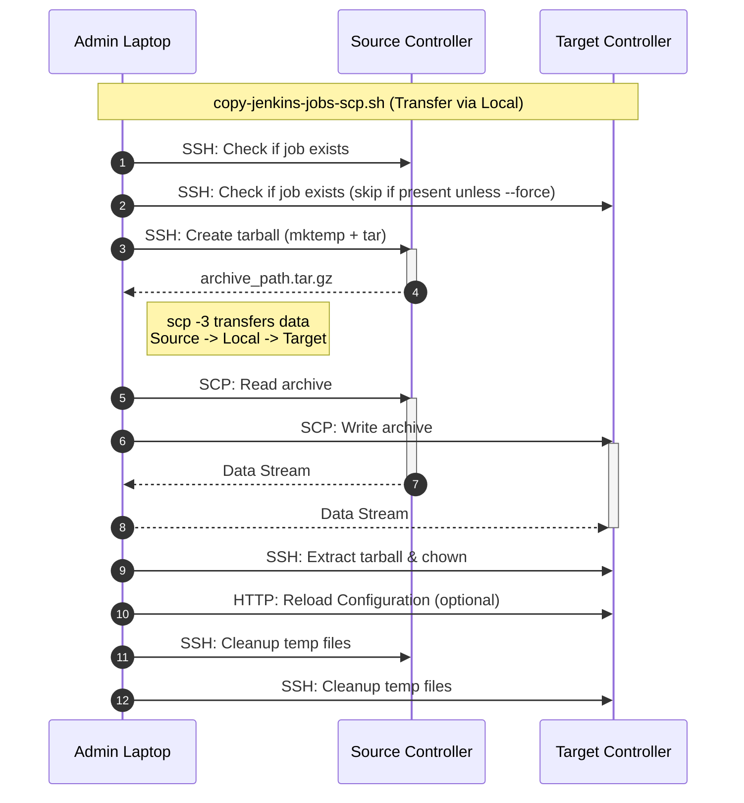
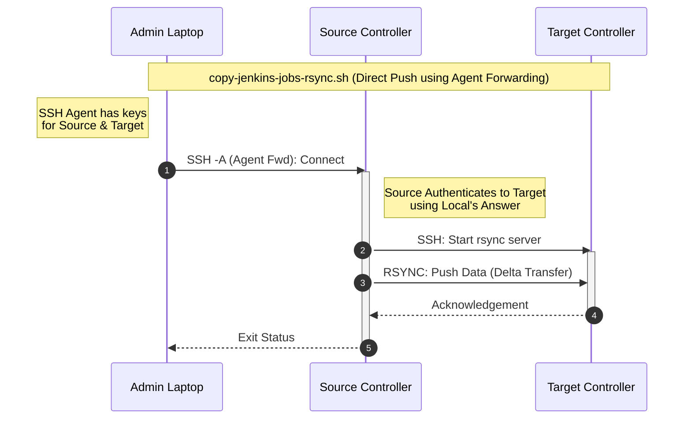

# Jenkins Job Copier

This repository contains scripts to copy Jenkins jobs from a source controller to a target controller.

## Scripts

1.  **`copy-jenkins-jobs-scp.sh`**: Uses `scp` and `tar` to archive and transfer jobs. Good for simple transfers or when `rsync` is not available.
2.  **`copy-jenkins-jobs-rsync.sh`**: Uses `rsync` over SSH. Efficient for syncing large jobs or incremental updates. Supports exclusions for build artifacts.
3.  **`updateJenkinsConfigTokens.sh`**: Updates webhook tokens in Jenkins job configurations (both plain-text and encrypted tokens).

---

## Workflows

### `copy-jenkins-jobs-scp.sh` (SCP Transfer)

Data flows through the admin's machine (`scp -3`).



### `copy-jenkins-jobs-rsync.sh` (Rsync Push)

Data flows directly between controllers. Source authenticates to Target using the Admin's SSH Agent.



### Security & SSH Key Management

The `rsync` script relies on **SSH Agent Forwarding** to securely authenticate between the source and target without storing long-lived credentials on the source host.

```mermaid
graph TD
    subgraph Laptop ["Admin Laptop"]
        Agent[SSH Agent]
        S_Key[Local SSH_KEY_FILE]
        Agent ---|Holds Identities| S_Key
    end

    subgraph Source ["Source Controller"]
        T_Key[Remote TARGET_SSH_KEY]
        F_Agent[Forwarded Agent]
    end

    subgraph Target ["Target Controller"]
        T_Auth[Authorized Keys]
    end

    S_Key ==>|1. Connect to Source| Source
    Agent -.->|2. SSH Agent Forwarding (-A)| F_Agent
    T_Key -.->|3. Identity Hint (-i)| F_Agent
    F_Agent ==>|4. Authenticate to Target| Target
    Target ---|Validates| T_Auth

    style Laptop fill:#f9f,stroke:#333,stroke-width:2px
    style Source fill:#bbf,stroke:#333,stroke-width:2px
    style Target fill:#bfb,stroke:#333,stroke-width:2px
```

1.  **Local SSH_KEY_FILE**: Used by the script on your laptop to authenticate and gain access to the **Source Controller**.
2.  **SSH Agent Forwarding**: The `-A` flag allows the **Source Controller** to "borrow" the SSH identities from your local machine's agent for subsequent connections.
3.  **Remote TARGET_SSH_KEY**: Specified via `--target-ssh-key`. This is a path *on the Source Controller* that acts as a hint for which forwarded identity to use when connecting to the **Target Controller**.
4.  **Authorized Keys**: The public parts of your keys must be added to the `authorized_keys` file on both Source and Target hosts.

## `copy-jenkins-jobs-scp.sh`

This is the main script for copying jobs using tarball archives.

### Requirements

- `bash`, `ssh`, `scp`, `tar`, `gzip`, `curl` must be installed on the machine running the script.
- The source and target controllers must be Linux-based.
- SSH access must be configured from the machine running the script to both Jenkins controllers. The SSH user must have `permissions` to read the Jenkins home directory and write to the target directory.

### Usage

```sh
./copy-jenkins-jobs-scp.sh [OPTIONS]
```

**Required:**
```
  `--source-host <host>`          Source Jenkins controller hostname or IP.
  `--target-host <host>`          Target Jenkins controller hostname or IP.
  `--source-user <user>`          SSH user for the source host.
  `--target-user <user>`          SSH user for the target host.
  `--job-path <path>`             Subpath of the job to copy (e.g., "teamA/job1"). Can be specified multiple times.
  ```

**Optional:**
```
  `--source-jenkins-home <path>`  Path to Jenkins home on the source. (Default: /var/jenkins_home)
  `--target-jenkins-home <path>`  Path to Jenkins home on the target. (Default: /var/jenkins_home)
  `--ssh-port-source <port>`      SSH port for the source host (Default: 22).
  `--ssh-port-target <port>`      SSH port for the target host (Default: 22).
  `--ssh-key-source <path>`       Path to the SSH private key for the source.
  `--ssh-key-target <path>`       Path to the SSH private key for the target.
  `--jenkins-url-target <url>`    URL of the target Jenkins for config reload.
  `--jenkins-user <user>`         Jenkins user for reload authentication.
  `--jenkins-token <token>`       Jenkins API token for reload authentication.
  `--jenkins-owner <user>`        The user/group to own the job files on target. (Default: jenkins)
  `--force`                       Overwrite existing jobs on the target.
  `--dry-run`                     Show what would be done without making changes.
  `--verbose`                     Enable verbose logging.
  `--help`                        Display this help message.
```

### Examples

#### 1. Copy a Single Job

Copies the job located at `/var/jenkins_home/jobs/production-deployment`.

```sh
./copy-jenkins-jobs-scp.sh \
  --source-host jenkins-prod.example.com \
  --target-host jenkins-staging.example.com \
  --source-user admin-user \
  --target-user admin-user \
  --ssh-key-source ~\.ssh/id_rsa_prod \
  --ssh-key-target ~\.ssh/id_rsa_staging \
  --job-path "production-deployment"
```

#### 2. Copy Multiple & Nested Jobs

Copies `nightly-builds` from the root of `jobs/` and `microservice-a` from a nested folder.

```sh
./copy-jenkins-jobs-scp.sh \
  --source-host jenkins-prod.example.com \
  --target-host jenkins-staging.example.com \
  --source-user admin-user \
  --target-user admin-user \
  --job-path "nightly-builds" \
  --job-path "team-alpha/pipelines/microservice-a"
```

#### 3. Force Overwrite and Reload with Authentication

Overwrites the destination job and uses an API token to reload the target controller's configuration.

```sh
./copy-jenkins-jobs-scp.sh \
  --source-host 10.0.1.10 \
  --target-host 10.0.2.20 \
  --source-user jenkins-svc \
  --target-user jenkins-svc \
  --job-path "important-job" \
  --force \
  --jenkins-url-target "https://jenkins.staging.example.com" \
  --jenkins-user "api-user" \
  --jenkins-token "11abcdef....."
```

#### 4. Dry Run

Preview the operations without making any changes.

```sh
./copy-jenkins-jobs-scp.sh \
  --source-host jenkins-prod.example.com \
  --target-host jenkins-staging.example.com \
  --source-user admin-user \
  --target-user admin-user \
  --job-path "teamA/job1" \
  --job-path "folderX/job2" \
  --dry-run \
  --verbose
```

---

## `copy-jenkins-jobs-rsync.sh`

This script uses `rsync` over SSH to synchronize jobs. It is more efficient for transfers (incremental) and allows powerful filtering.

### Requirements

- `rsync` must be installed on the **Source** and **Target** controllers.
- **SSH Agent Forwarding**: The script runs locally but executes `rsync` on the Source. You must have `ssh-agent` running locally with keys for both Source and Target loaded.
    - Run `ssh-add ~/.ssh/id_rsa_source` and `ssh-add ~/.ssh/id_rsa_target` before running the script.
- The Source host must be able to connect to the Target host on the SSH port.

### Usage

```sh
./copy-jenkins-jobs-rsync.sh [OPTIONS]
```

**Required:**
```
  `--source-host <host>`          Source Jenkins controller hostname or IP.
  `--target-host <host>`          Target Jenkins controller hostname or IP.
  `--source-user <user>`          SSH user for the source host.
  `--target-user <user>`          SSH user for the target host.
  `--ssh-key-file <path>`              Path to the SSH private key for the source host.
  `--job-path <path>`             Subpath of the job to sync.
 ```

**Optional:**
```
  `--source-jenkins-home <path>`  Path to Jenkins home on the source. (Default: /var/jenkins_home)
  `--target-jenkins-home <path>`  Path to Jenkins home on the target. (Default: /var/jenkins_home)
  `--ssh-port-source <port>`      SSH port for the source host (Default: 22).
  `--ssh-port-target <port>`      SSH port for the target host (Default: 22).
  `--target-ssh-key <path>`       Path to the SSH private key for the target host (used by rsync on the source). (Default: ~/.ssh/id_ed25519)
  `--exclude <pattern>`           Rsync exclude pattern (e.g., 'builds/', 'workspace/'). Can be specified multiple times.
  `--delete`                      Delete extraneous files on the target (`rsync --delete`).
  `--dry-run`                     Show what would be done without making changes.
  `--verbose`                     Enable verbose logging.
  `--help`                        Display this help message.
```

### Examples

#### 1. Basic Job Sync

Synchronize a job while excluding the workspace and build history.

```sh
./copy-jenkins-jobs-rsync.sh \
  --source-host source.jenkins.example.com --source-user admin \
  --target-host target.jenkins.example.com --target-user admin \
  --ssh-key-file ~/.ssh/id_rsa_source \
  --target-ssh-key ~/.ssh/id_rsa_target \
  --job-path "MyFolder/MyJob" \
  --exclude "builds/" \
  --dry-run
```

#### 2. Sync with Delete

This will make the target directory an exact mirror of the source, DELETING any files on the target that are not present on the source.

```sh
./copy-jenkins-jobs-rsync.sh \
  --source-host source.jenkins.example.com --source-user admin \
  --target-host target.jenkins.example.com --target-user admin \
  --ssh-key-file ~/.ssh/id_rsa_source \
  --job-path "MyProject" \
  --delete
```

