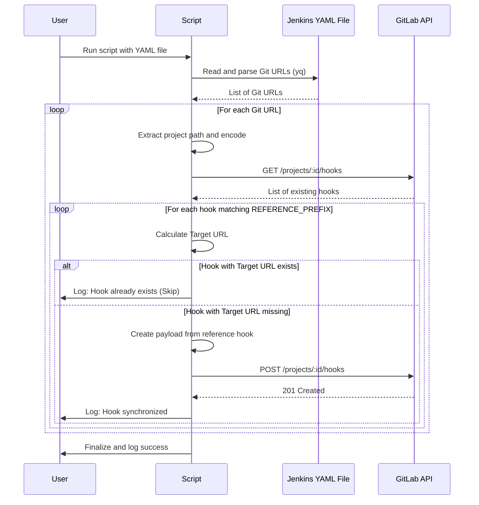

# GitLab Webhook Synchronization Script

This script automates the synchronization of GitLab project webhooks. It parses Git URLs from a Jenkins Configuration as Code (CasC) YAML file and ensures that the corresponding GitLab projects have the required webhooks configured for a target Jenkins controller, based on existing "reference" hooks.

## Features

- **Automated Parsing:** Extracts Git repository URLs from both `multibranch` and standard `pipeline` jobs in Jenkins YAML exports.
- **Template-based Creation:** Finds existing hooks matching a "reference" URL prefix and copies their exact configuration (events, SSL verification, etc.) to a new hook for the target controller.
- **Duplicate Prevention:** Checks if a hook with the target URL already exists before creating a new one to avoid redundant triggers.
- **Customizable:** Supports custom GitLab server instances and configurable API endpoints.
- **Secret Management:** Supports injecting a Webhook Secret Token (manually set or auto-generated).

## Prerequisites

The following tools must be installed on your system:

- `yq` (v4.x): For parsing YAML files.
- `jq`: For processing JSON data from the GitLab API.
- `curl`: For making API requests.
- `openssl`: For generating random webhook secrets (if not provided).

## Configuration

The script can be configured using environment variables or a `.env` file located in the same directory as the script.

| Variable | Description | Default |
|----------|-------------|---------|
| `GITLAB_SERVER` | The hostname of your GitLab instance. | `gitlab.com` |
| `API_URL` | The GitLab API base URL. | `https://gitlab.com/api/v4` |
| `GITLAB_TOKEN` | A Personal Access Token with API scope. | *Required* |
| `WEBHOOK_REFERENCE_URL_PREFIX` | The URL prefix of the source Jenkins controller hooks to copy. | `https://ci.source.com` |
| `WEBHOOK_TARGET_URL_PREFIX` | The URL prefix for the new Jenkins controller. | `https://ci.target.com` |
| `WEBHOOK_SECRET` | The secret token to be set on the new webhooks. | *Auto-generated* |

## Workflow Diagram

## How it Works

1. **Extraction:** The script scans the YAML file for GitLab repository URLs.
2. **Discovery:** For each repository, it queries the GitLab API to list all existing webhooks.
3. **Matching:** it looks for hooks whose URL starts with the `WEBHOOK_REFERENCE_URL_PREFIX`.
4. **Mapping:** It takes the "path" part of the reference hook (e.g., `/project-a/notify`) and appends it to the `WEBHOOK_TARGET_URL_PREFIX`.
5. **Validation:** It verifies if this new target URL already exists in the project.
6. **Creation:** If not present, it creates a new hook copying all settings from the reference hook but using the new target URL and the `WEBHOOK_SECRET`.
